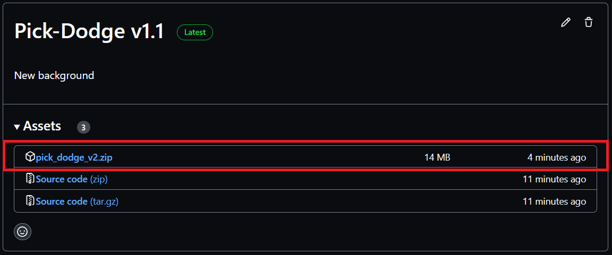
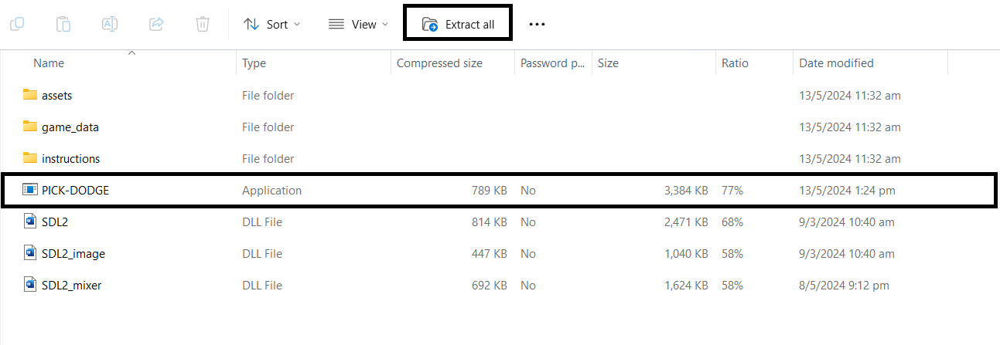
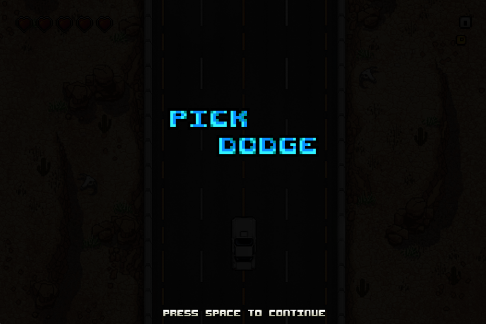
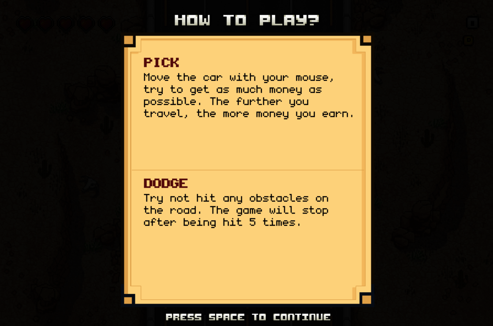
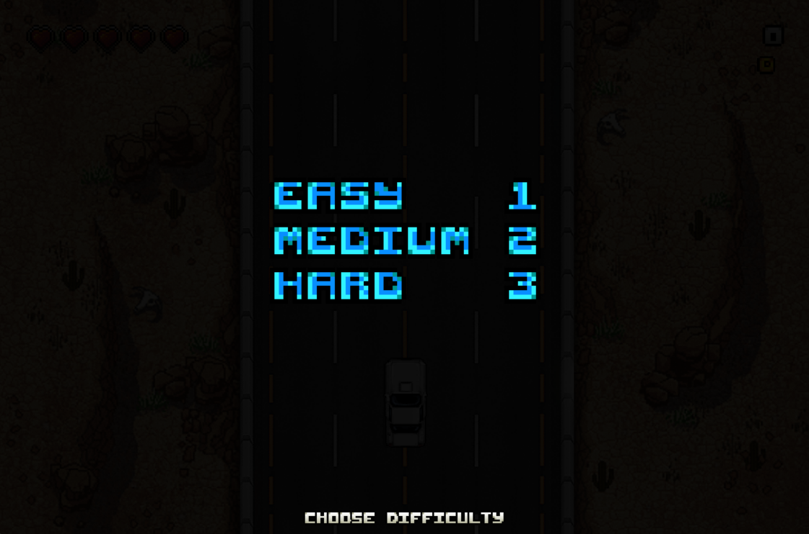
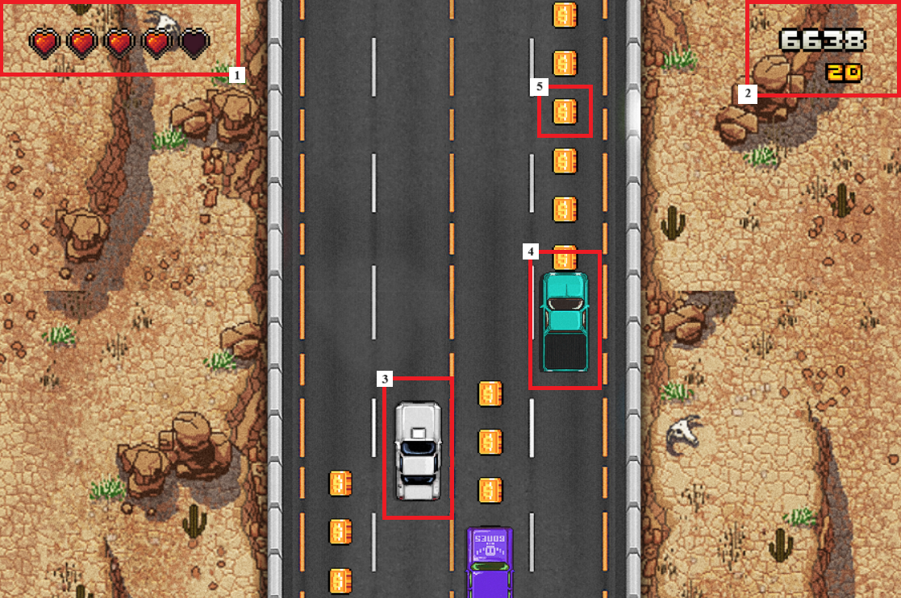
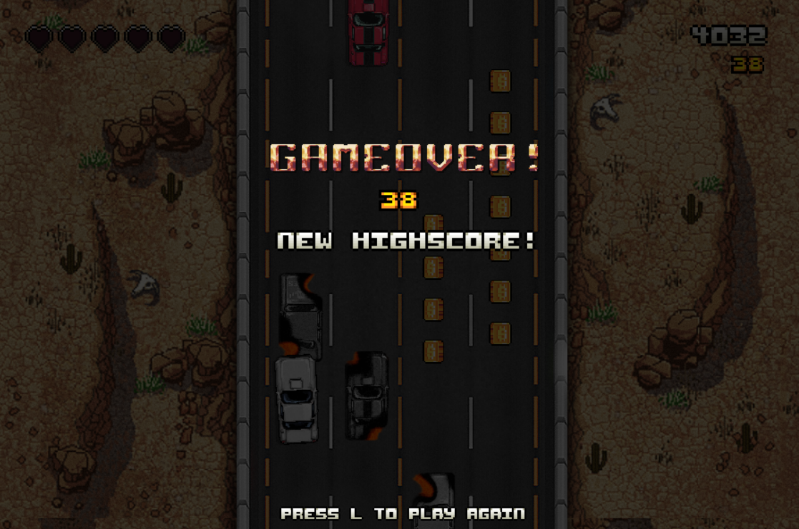

# INTRODUCTION:

Pick & Dodge is a game in the genre of racing and reflexes. Players need to use their reflexes to avoid other vehicles on the way and survive as long as possible. In this game, the amount of money in the game is the final score of the game. Therefore, players also need to collect as much money as possible at the same time to achieve the highest score.

# I. <ins>INSTALLING</ins>:

Players can download the game from the file with the "Latest"" tag [here](https://github.com/Granchio0912/Pick-Dodge/releases/).

After installing the "pick_dodge_v2.zip", unzip the file and run "PICK_&_DODGE" to start playing the game.

# II. <ins>GAMEPLAY</ins>:

## 1. <ins>Starting screen</ins>:

The starting screen appears after running the game.

Press the **SPACE** key to move to the next screen - showing the instructions.

Press the **SPACE** key again to move to the difficulty selection screen. The difficulty level is selected by pressing the **1**, **2**, or **3** keys, corresponding to the Easy, Medium, and Hard levels of the game, respectively.

| DIFFICULTY | DESCRIPTION                                         |
| ---------- | --------------------------------------------------- |
| Easy       | Player's car increases its speeds after every 7.00s |
| Medium     | Player's car increases its speeds after every 6.75s |
| Hard       | Player's car increases its speeds after every 6.50s |

## 2. <ins>In-game screen</ins>:

**Player's car:**

- The player's car is the white one (3), controlled by the player's mouse or computer touchpad.
- As the car travels farther, its speed increases. Players can track the distance traveled in the upper right corner of the screen (2).

**Obstacle cars**

- All other cars on the four lanes are obstacle cars (4).
- Obstacle cars in the same lane have the same speed and appear randomly across all four lanes.
- Players needs to avoid collisions with these obstacle cars while driving. If a collision occurs once, one life is lost (1). The game ends if five collisions occur.

**Coins**

- Coins (5) in the game move at the same speed and appear randomly on the four lanes.
- The number of coins collected is the final score in the game. Players should try to collect as many coins as possible.
- Players can track the number of coins collected during the game in the lower part of the upper right corner of the screen (2).

During the game, players can press the **SPACE** key to pause the game and press the **SPACE** key again to resume the game.

## 3. <ins>Ending screen</ins>:

- At the end of the game, the screen will display the player's score and the recorded highscore from previous games corresponding to the chosen difficulty level.

- In case the current score is a new record for the chosen difficulty, the ending screen will notify the player of this achievement.

- Players can press the **L** key to start a new game.

# III. <ins>Credits</ins>:

- **Font pack** by [zingot](https://zingot.itch.io/fontpack)

- **Car's sprites** by [tokka](https://tokka.itch.io/top-down-car)

- **Coin's sprites** by [TotusLotus](https://totuslotus.itch.io/pixel-coins)

- **Background** by [Mariusz Szulc](https://www.behance.net/gallery/29946977/Must-Deliver-Backgrounds)

- Background music [SURV1V3](https://www.youtube.com/watch?v=aSSNGTSeqCI&list=PLTTPXh1mAdvNcWsNVVxxlVtU46u9ZqQ-r&ab_channel=RedlineRacer) by [Daiki Kasho](https://en.wikipedia.org/wiki/Daiki_Kasho)
