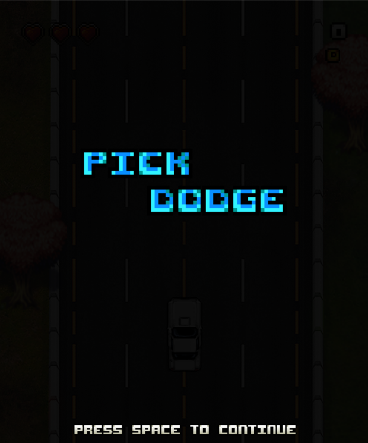
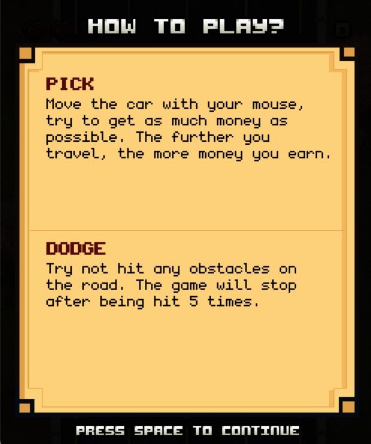
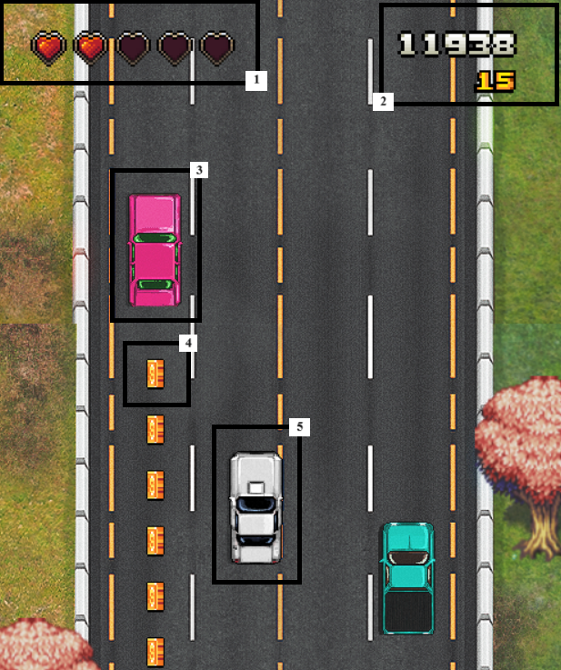
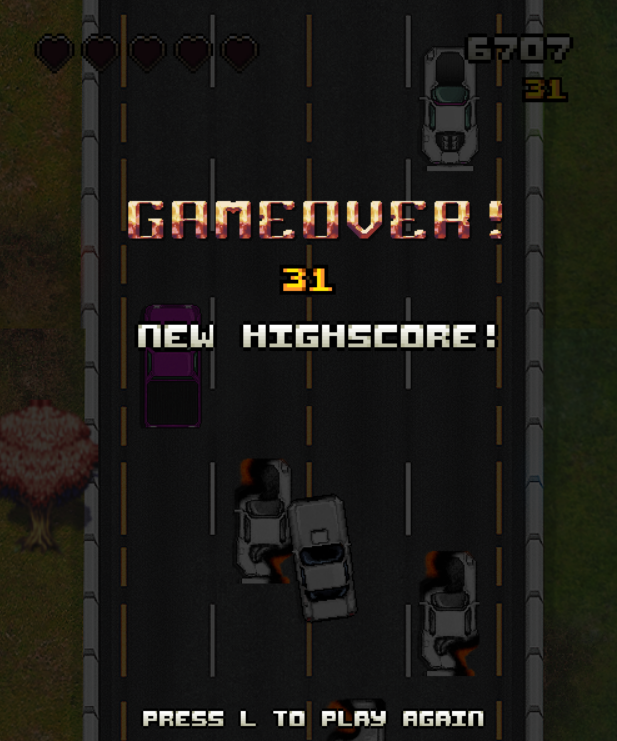

# GIỚI THIỆU

Pick & Dodge là một trò chơi thuộc thể loại đua xe và phản xạ. Người chơi cần sử dụng khả năng phản xạ của mình để tránh các xe khác trên đường đi và tồn tại lâu nhất có thể. Trong trò chơi này, số tiền nhặt được trong trò chơi chính là số điểm cuối cùng của trò chơi. Vì vậy, người chơi cũng cần đồng thời thu về nhiều tiền nhất có thể để đạt được số điểm cao nhất.

# II. <ins>Hướng dẫn chơi</ins>:

## 1. <ins>Màn hình bắt đầu</ins>:

Màn hình sẽ xuất hiện khi người chơi bắt đầu khởi động trò chơi.

Người chơi cần bấm phím Space để tiếp tục đến với màn hình hướng dẫn của trò chơi.

Người chơi cần bấm phím Space một lần nữa để đến với màn hình chọn độ khó. Độ khó được chọn bằng cách bấm phím 1, 2 hoặc 3 tương đương lần lượt với 3 độ khó Easy, Medium và Hard của trò chơi này.

| ĐỘ KHÓ | MÔ TẢ                                                  |
| ------ | ------------------------------------------------------ |
| Easy   | Tốc độ xe của người chơi sẽ tăng lên sau mỗi 7.00 giây |
| Medium | Tốc độ xe của người chơi sẽ tăng lên sau mỗi 6.75 giây |
| Hard   | Tốc độ xe của người chơi sẽ tăng lên sau mỗi 6.50 giây |

## 2. <ins>Màn hình chơi</ins>:

**Xe của người chơi**

- Xe của người chơi là xe màu trắng (5), được người chơi điều khiển bằng chuột hoặc touchpad của máy tính.
- Khi xe đi càng xa, tốc độ xe càng tăng, người chơi có thể theo dõi quãng đường đi được ở dòng trên - góc trên bên phải của màn hình (2).

**Xe chướng ngại vật**

- Tất cả các xe khác trên 4 làn đường là các xe chướng ngại vật (3).
- Các xe trên một làn đường có cùng một tốc độ, xuất hiện ngẫu nhiên trên cả 4 làn đường.
- Người chơi cần tránh va chạm các xe khi di chuyển trên đường, nếu va chạm 1 lần sẽ mất một mạng (1), trò chơi sẽ kết thúc nếu va chạm xảy ra 5 lần.

**Tiền**

- Các đồng tiền (4) trong trò chơi có cùng một tốc độ di chuyển, xuất hiện ngẫu nhiên trên 4 làn đường.
- Số tiền nhặt được chính là số điểm cuối cùng trong trò chơi, người chơi cần cố gắng thu thập được nhiều tiền nhất có thể.
- Người chơi có thể theo dõi số tiền đã nhặt được trong quá trình ở dòng dưới - góc trên bên phải của màn hình (2).

Trong quá trình chơi, người chơi có thể bấm phím Space để tạm dừng trò chơi bất kỳ lúc nào.

## 3. <ins>Màn hình kết thúc</ins>:

- Khi kết thúc, trò chơi sẽ cho biết số điểm của người chơi và số điểm kỉ lục đã được lưu lại ở các lần chơi trước ứng với độ khó đã được người chơi chọn.

- Nếu số điểm người chơi đạt được là số điểm kỉ lục tương ứng với độ khó người chơi chọn, màn hình kết thúc sẽ thông báo điều đó:

- Sau khi kết thúc lượt chơi, người chơi có thể bấm phím "L" để bắt đầu một lần chơi mới.
